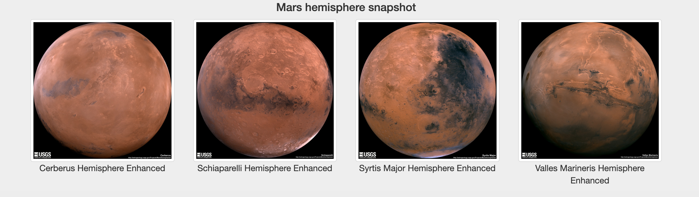

# Mission-to-Mars

### Overview:
   
   Create a webpage for Mission to Mars by scraping the data from NASA as a need basis and storing them in MongoDB. 
   
### Details:

   Created a web scraping application using python which scrapes data from NASA about the mission to Mars using splinter, BeautifulSoup, Pandas. These scraped data are stored in a NoSQL database "MongoDB" for further display. Exposed a UI using bootstrap and flask and rendered the HTML so we can see the scraped data 
   
## Challenge 

### Overview:

   Scrape additional Mars hemisphere details and update the webpage with the picture as a thumbnail.
   
### Details:

   Created a function to scrape for Mars hemisphere details and collect both the title and image URL. Store the same in MongoDB for rendering it on the webpage. While rendering the pictures of the Mars hemisphere we can render them as a response thumbnail which can scale according to the device and screen size 
   
