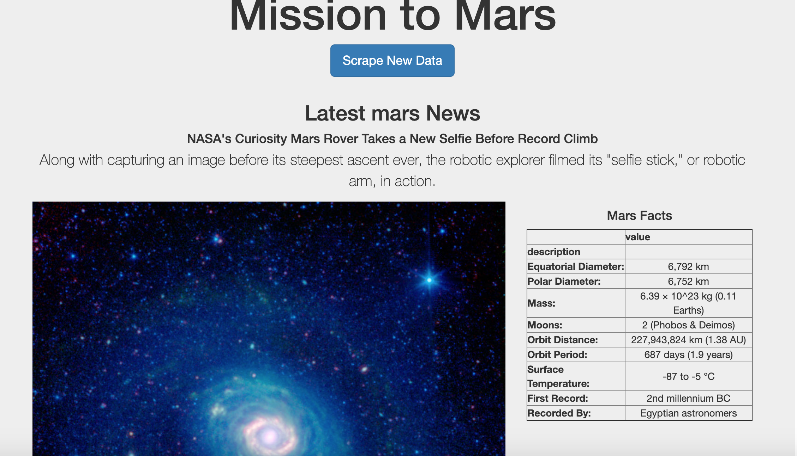

# Mission-to-Mars

## Overview:
   
   Create a webpage for Mission to Mars by scraping the data from NASA as need basis and storing them in mongodb.
   
## Details:

   Created a webscraping application using python which scrapes data from NASA about mission to mars using splinter, BeautifulSoup, Pandas. These scraped data are stored in a NoSQL database "mongodb" for further display. Exposed a UI using bootstrap and flask and rendered the html so we can see the scraped data 
   
   
